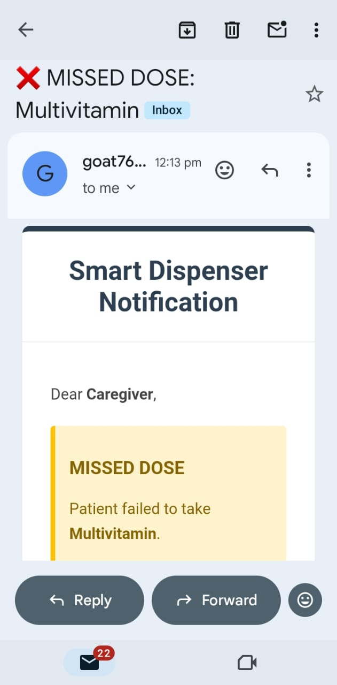

# 🏥 Smart Medical Pill Dispenser using STM32F401RE

<p align="center">


</p>

---

# 📖 Overview

The **Smart Medical Pill Dispenser** is an embedded healthcare system designed to help elderly and chronically ill patients take medicines on time.

The project combines an **STM32F401RE microcontroller**, **DS3231 RTC**, **dual LCD displays**, **servo motor**, **IR sensors**, and a **Python Tkinter desktop application** to automate medication dispensing while maintaining medication history and stock management.

The system can also notify caregivers through **email alerts** whenever medications are missed or stock becomes unavailable.

---

# ✨ Features

## 🔧 Embedded System

- Real-Time Clock Scheduling using DS3231
- Automatic Servo Motor Pill Dispensing
- Dual LCD Display (Hardware I2C + Software I2C)
- IR Sensors for Pill Detection
- Buzzer and LED Alerts
- Missed Alarm Queue Handling
- UART Communication with Desktop Application

---

## 🖥 Python Desktop Application

- Dashboard
- Alarm Scheduler
- Tablet Inventory
- Medication History
- Email Configuration
- Real-Time STM32 Communication
- JSON Database
- Automatic Stock Tracking

---

# 🏗 Hardware Setup

<p align="center">

</p>

---

# ⚙ Hardware Components

- STM32F401RE
- DS3231 RTC
- Servo Motor
- IR Sensors
- Dual 16x2 LCD
- LEDs
- Buzzer
- Push Buttons
- USB UART

---

# 💻 System Architecture

```text
                DS3231 RTC
                     │
                     ▼
             STM32F401RE MCU
        ┌────────────┼────────────┐
        │            │            │
        ▼            ▼            ▼
    Servo Motor   Dual LCD    IR Sensors
        │
        ▼
 Pill Dispensing System
        │
        ▼
 UART JSON Communication
        │
        ▼
 Python Tkinter GUI
        │
        ▼
 Email Notification System
```

---

# 🔄 System Workflow

1. RTC continuously checks scheduled alarm time.
2. STM32 activates buzzer and LCD notification.
3. Servo motor dispenses medication.
4. IR sensors verify pill dispensing.
5. Python GUI receives JSON data through UART.
6. Inventory is updated.
7. Email notification is sent if medication is missed.

---

# 🖥 Dashboard

<p align="center">

</p>

The dashboard displays:

- Current Time
- Upcoming Alarm
- Missed Alarms
- Dispensed Medicines
- Tablet Inventory
- System Status

---

# ➕ Alarm Management

<p align="center">

</p>

Users can

- Add Alarm
- Edit Alarm
- Delete Alarm
- Repeat Daily
- Select Medicines

---

# 💊 Tablet Inventory

<p align="center">

</p>

Features

- Add Medicines
- Update Stock
- Low Stock Detection
- Automatic Quantity Reduction
- Out-of-Stock Detection

---

# 💊 Dispensing Process

<p align="center">

</p>

STM32 controls the servo motor to dispense pills while IR sensors verify successful dispensing.

---

# 📜 Medication History

<p align="center">

</p>

Stores

- Dispensing Time
- Medication Name
- Alarm Status
- Missed Medicines
- Event Logs

---

# ⏳ Pending Medicines

<p align="center">

</p>

Displays medications that have not yet been dispensed.

> **Note:** If your filename is actually `gui pending.jpg` (without the extra space before `.jpg`), use:
>
> ```markdown
> 
> ```

---

# 📧 Email Notifications

<p align="center">

</p>

Automatic email alerts are generated when:

- Medication is missed
- Stock becomes zero
- Tablet refill is required

The system uses a professional HTML email template for caregivers.

---

# 🖥 STM32 Hardware Prototype

<p align="center">

</p>

---

# 🛠 Technologies Used

### Embedded

- STM32F401RE
- Embedded C
- UART
- GPIO
- Timers
- PWM
- Hardware I2C
- Software I2C
- Interrupts

### Software

- Python
- Tkinter
- JSON
- SMTP
- Multithreading
- Serial Communication

---

# 📂 Project Structure

```
Smart-pill-dispenser-using-STM32F401RE
│
├── images/
│   ├── dispensing.jpg
│   ├── email_notification.jpg
│   ├── full setup.jpg
│   ├── gui alarm adding.jpg
│   ├── gui dispensing.jpg
│   ├── gui full schedule completed.jpg
│   ├── gui history.jpg
│   ├── gui pending.jpg
│   ├── gui tablet.jpg
│   └── hardware setup2.jpg
│
├── Smart_pill.c
├── gui_smart_pill.py
├── uart.c
└── README.md
```

---

# 🚀 Running the Project

## 1️⃣ Flash STM32

Compile **Smart_pill.c** using

- Keil uVision
- STM32CubeIDE

Flash the firmware to the STM32F401RE board.

---

## 2️⃣ Run Python GUI

```bash
python gui_smart_pill.py
```

---

## 3️⃣ Configure Serial Port

```python
SERIAL_PORT = "COM5"
```

---

# 📌 Future Improvements

- ESP32 Wi-Fi Connectivity
- Mobile Application
- MQTT Cloud Integration
- Caregiver Mobile Notifications
- Voice Assistant Support
- Battery Backup
- AI-Based Medication Reminder

---

# 👨‍💻 Author

**Naveen Kumar A**

M.Tech Embedded Systems  
Amrita Vishwa Vidyapeetham

GitHub: https://github.com/At-Naveen-kumar-2003

---

# ⭐ If you found this project useful, please consider giving it a star!
