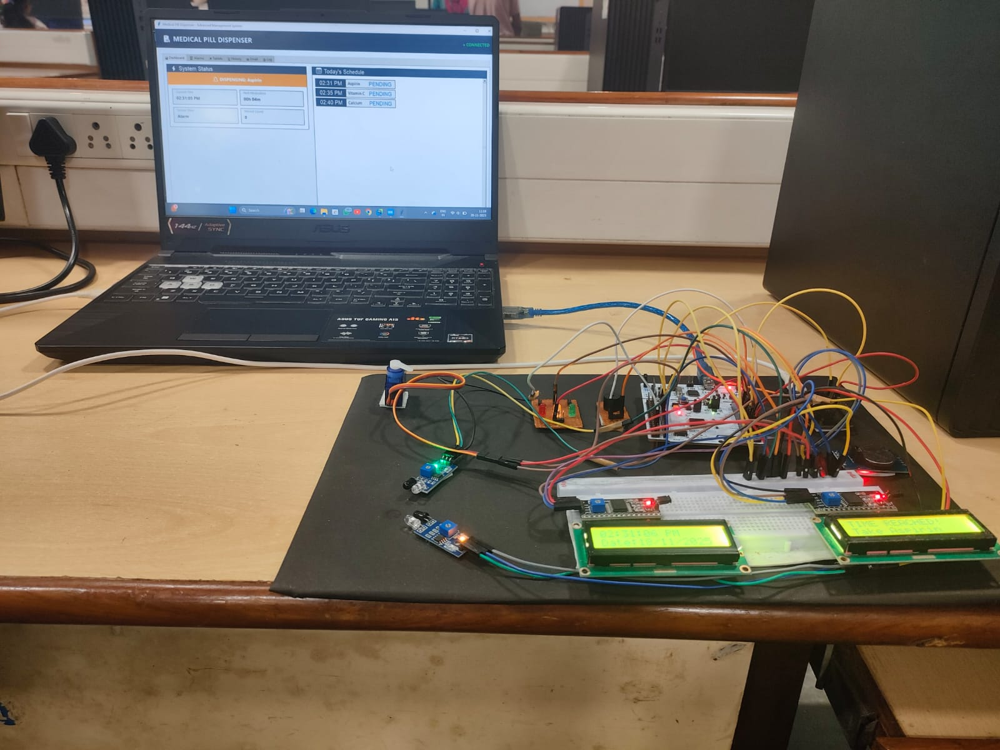
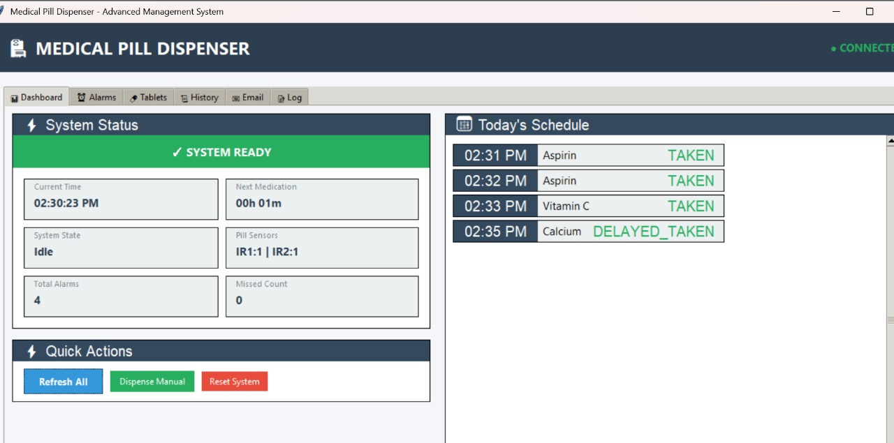
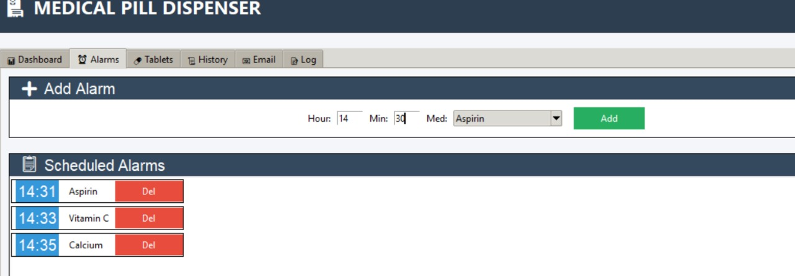
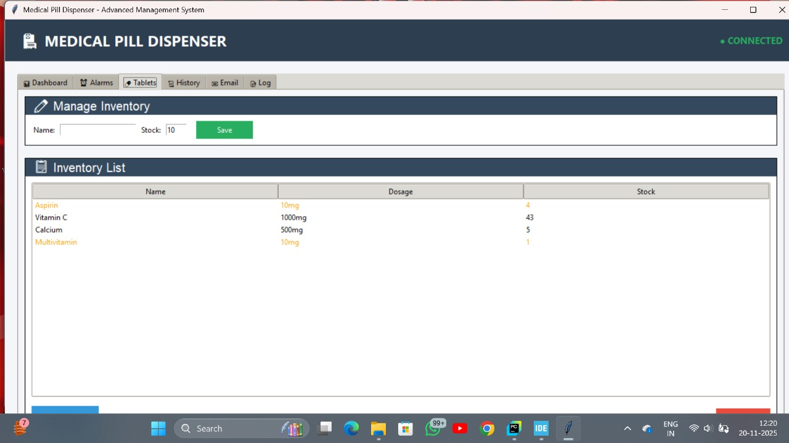
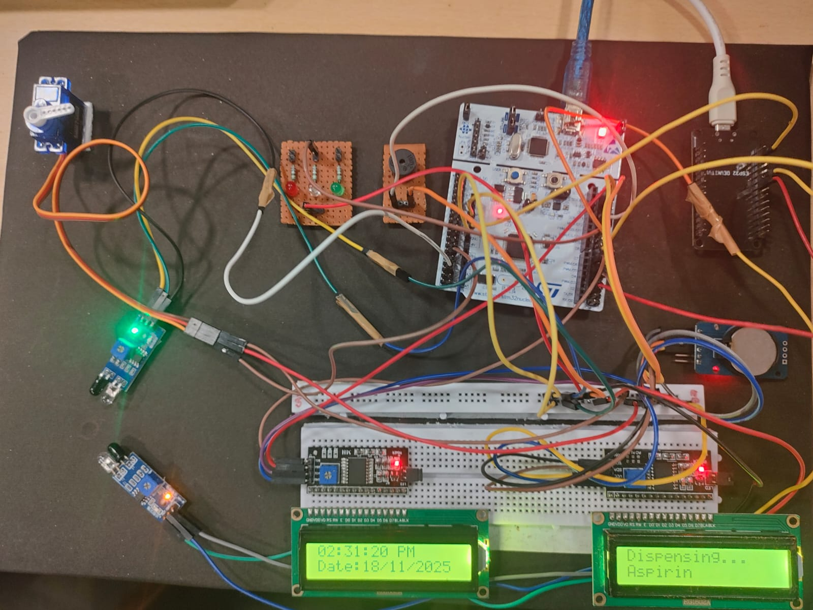
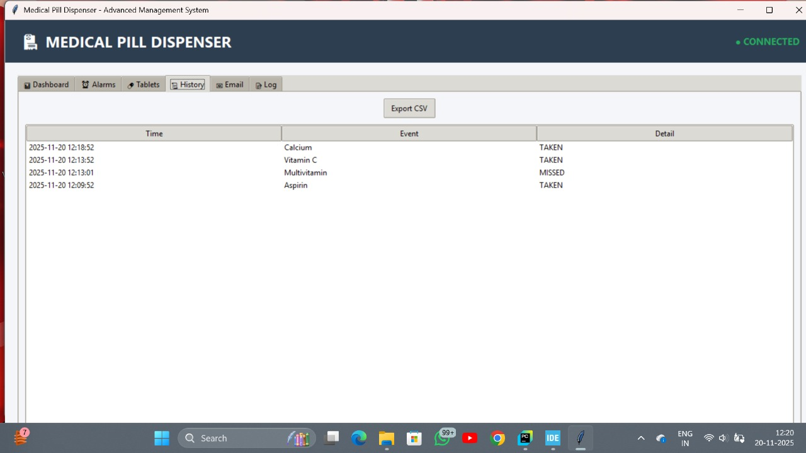

# 🏥 Smart Medical Pill Dispenser using STM32F401RE

<p align="center">


</p>

---

# 📖 Overview

The **Smart Medical Pill Dispenser** is an embedded healthcare automation system designed to help elderly patients and individuals with chronic illnesses take their medications on time.

The system combines an **STM32F401RE microcontroller**, **DS3231 Real-Time Clock**, **dual LCD displays**, **servo motor**, **IR sensors**, and a **Python Tkinter desktop application** to automate medication dispensing, maintain tablet inventory, and send email notifications to caregivers.

---

# ✨ Key Features

## 🔧 Embedded System

- Real-Time Clock Scheduling using DS3231
- Automatic Servo-Based Pill Dispensing
- Dual LCD Display
- IR Sensor Based Pill Detection
- Buzzer & LED Alerts
- UART Communication with Desktop Application
- Missed Alarm Queue Management

---

## 🖥 Desktop GUI

- Dashboard
- Alarm Scheduling
- Tablet Inventory
- Medication History
- Email Configuration
- Live STM32 Status
- Automatic Stock Management
- JSON Database Storage

---

# 🏗 Hardware Prototype

<p align="center">

</p>

The hardware prototype consists of the STM32F401RE board, RTC module, servo motor, IR sensors, LCD displays, buzzer, LEDs, and power supply connected to perform automated medication dispensing.

---

# ⚙ Hardware Components

- STM32F401RE
- DS3231 RTC Module
- Servo Motor
- Dual 16x2 LCD Display
- IR Sensors
- LEDs
- Buzzer
- Push Buttons
- USB-UART Interface

---

# 💻 System Architecture

```text
               DS3231 RTC
                    │
                    ▼
            STM32F401RE MCU
       ┌───────────┼────────────┐
       │           │            │
       ▼           ▼            ▼
 Servo Motor    LCD Display   IR Sensors
       │
       ▼
 Pill Dispensing
       │
       ▼
 UART Communication
       │
       ▼
 Python Tkinter GUI
       │
       ▼
 Email Notification
```

---

# 🔄 System Workflow

1. RTC continuously monitors the current time.
2. When the scheduled alarm time matches, STM32 activates the buzzer and LCD notification.
3. The servo motor dispenses the required medication.
4. IR sensors verify successful pill dispensing.
5. The GUI receives live data through UART.
6. Tablet inventory is automatically updated.
7. Email notification is sent if medication is missed or stock reaches zero.

---

# 🖥 Dashboard

<p align="center">

</p>

The dashboard displays:

- Current Time
- Upcoming Alarm
- Missed Medication Count
- Tablet Inventory
- System Status
- Dispensing Status

---

# ➕ Alarm Management

<p align="center">

</p>

Users can

- Add Alarm
- Edit Alarm
- Delete Alarm
- Select Medicine
- Configure Daily Schedule

---

# 💊 Tablet Inventory

<p align="center">

</p>

The inventory module allows users to

- Add Medicines
- Update Tablet Stock
- Detect Low Stock
- Track Remaining Tablets
- Automatically Reduce Quantity After Dispensing

---

# 💊 Pill Dispensing

<p align="center">



</p>

The servo motor automatically dispenses medication at the scheduled time while the IR sensors verify successful dispensing.

---

# 📜 Medication History

<p align="center">

</p>

The application maintains a complete medication history including

- Medicine Name
- Dispensing Time
- Alarm Status
- Missed Medications
- Event Logs

---

# ⏳ Pending Medications

<p align="center">

</p>

Displays medications that are scheduled but have not yet been dispensed.

---

# 📧 Email Notification

<p align="center">

</p>

Automatic email alerts are generated when

- Medication is missed
- Stock becomes empty
- Tablet refill is required

These notifications help caregivers monitor patient medication adherence.

---

# 🛠 Technologies Used

## Embedded

- STM32F401RE
- Embedded C
- GPIO
- Timers
- PWM
- UART
- Hardware I2C
- Software I2C
- Interrupts

## Software

- Python
- Tkinter
- JSON
- SMTP Email
- Serial Communication
- Multithreading

---

# 📂 Project Structure

```
Smart-pill-dispenser-using-STM32F401RE
│
├── images
│   ├── dispensing.jpg
│   ├── email_notification.jpg
│   ├── full-setup.jpg
│   ├── gui-alarm-adding.jpg
│   ├── gui-dispensing.jpg
│   ├── gui-full-schedule-completed.jpg
│   ├── gui-history.jpg
│   ├── gui-pending.jpg
│   └── gui-tablet.jpg
│
├── Smart_pill.c
├── uart.c
├── gui_smart_pill.py
└── README.md
```

---

# 🚀 How to Run

## Step 1 — Flash STM32 Firmware

Compile **Smart_pill.c** using

- Keil uVision
- STM32CubeIDE

Flash the firmware to the STM32F401RE board.

---

## Step 2 — Run Python GUI

```bash
python gui_smart_pill.py
```

---

## Step 3 — Configure Serial Port

```python
SERIAL_PORT = "COM5"
```

Run the GUI and connect to the STM32 board through UART.

---

# 📈 Future Improvements

- ESP32 Wi-Fi Integration
- Mobile Application
- MQTT Cloud Monitoring
- Caregiver Mobile Notifications
- Voice Assistant Integration
- Battery Backup
- AI-Based Medication Prediction

---

# 👨‍💻 Author

**Naveen Kumar A**

M.Tech Embedded Systems  
Amrita Vishwa Vidyapeetham

GitHub: https://github.com/At-Naveen-kumar-2003

---
